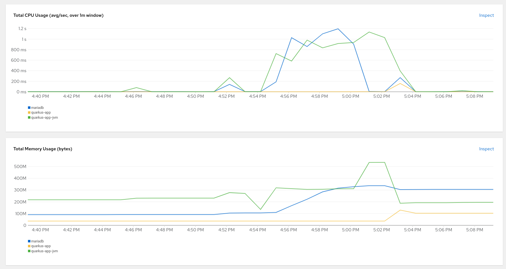

# Quarkus

https://quarkus.io/guides/maven-tooling

```console
mvn io.quarkus.platform:quarkus-maven-plugin:2.11.2.Final:create
```

For running quarkus un dev mode and you can change the code in real time, run next comand

```console
mvn compile quarkus:dev
```

List extensions of Quarkus & add extensions for DB

```console
mvn quarkus:list-extensions
mvn quarkus:add-extensions -Dextensions="quarkus-hibernate-orm-panache, quarkus-jdbc-mariadb"
```

Add extension for Rest

```console
mvn quarkus:add-extensions -Dextensions="quarkus-resteasy-reactive-jackson"
```

Before to compile project it's important download graalvm from https://github.com/graalvm/mandrel/releases/tag/mandrel-22.1.0.0-Final
```console
$ tar -xf mandrel-java11-linux-amd64-22.1.0.0-Final.tar.gz
$ export JAVA_HOME="$( pwd )/mandrel-java11-22.1.0.0-Final"
$ export GRAALVM_HOME="${JAVA_HOME}"
```

Or, if you don't have GraalVM installed, you can run the native executable build in a container using: 
```shell script
./mvnw package -Pnative -Dquarkus.native.container-build=true
```

Compile proyect in knative container
```console
./mvnw package -Pnative -Dquarkus.native.container-runtime=podman -Dquarkus.native.container-build=true
podman build -t quarkus-jvm -f src/main/docker/Dockerfile.jvm .
podman build -t quarkus-native -f src/main/docker/Dockerfile.native .
 ```

 Run images in the same pod and use 127.0.0.1 like a host
 ```console
$ podman pod create --name mariadb-quarkus -p 3306:3306 -p 8081:8080 

$ podman run -d --pod mariadb-quarkus --name mariadb -e MARIADB_USER=mariadb -e MARIADB_PASSWORD=mariadb -e MARIADB_ROOT_PASSWORD=mariadb -e MARIADB_DATABASE=quarkus mariadb:latest

$ podman run -d --name quarkus-jvm --pod mariadb-quarkus -e DB_USER=mariadb -e DB_KIND=mariadb -e DB_URL=jdbc:mariadb://127.0.0.1:3306/quarkus -e DB_PASSWORD=mariadb localhost/quarkus-jvm
or
$ podman run -d --name quarkus-native --pod mariadb-quarkus -e DB_USER=mariadb -e DB_KIND=mariadb -e DB_URL=jdbc:mariadb://127.0.0.1:3306/quarkus -e DB_PASSWORD=mariadb localhost/quarkus-native
 ```

if you want to check stadistics run ```podman stats quarkus-...```

Now we run images in diferent pods
```console
$ podman network create --name quarkus
$ podman pod create --name mariadbQ --network quarkus -p 3306:3306
$ podman pod create --name quarkusQ --network quarkus -p 8082:8080

$ podman run -d --pod mariadbQ --name mariadbD -e MARIADB_USER=mariadb -e MARIADB_PASSWORD=mariadb -e MARIADB_ROOT_PASSWORD=mariadb -e MARIADB_DATABASE=quarkus mariadb:latest

$ podman run -d --name quarkus-jvmD --pod quarkusQ -e DB_USER=mariadb -e DB_KIND=mariadb -e DB_URL=jdbc:mariadb://mariadbQ:3306/quarkus -e DB_PASSWORD=mariadb localhost/quarkus-jvm

or

$ podman run -d --name quarkus-nativeD --pod quarkusQ -e DB_USER=mariadb -e DB_KIND=mariadb -e DB_URL=jdbc:mariadb://mariadbQ:3306/quarkus -e DB_PASSWORD=mariadb localhost/quarkus-native
```

Deploy in openshift with Dockerfile.jvm
```console
oc new-build --binary --name=quarkus-jvm -l app=quarkus-jvm
oc patch bc quarkus-jvm -p '{"spec":{"strategy":{"dockerStrategy":{"dockerfilePath":"src/main/docker/Dockerfile.jvm"}}}}'
oc start-build quarkus-jvm --from-dir=. --follow
oc new-app --image-stream=quarkus-jvm:latest -e DB_USER=mariadb -e DB_KIND=mariadb -e DB_URL=jdbc:mariadb://mariadb:3306/quarkus -e DB_PASSWORD=mariadb
oc expose service quarkus-jvm
```

Deploy in openshift with Dockerfile.native
```console
oc new-build --binary --name=quarkus-native -l app=quarkus-native
oc patch bc quarkus-native -p '{"spec":{"strategy":{"dockerStrategy":{"dockerfilePath":"src/main/docker/Dockerfile.native"}}}}'
oc start-build quarkus-native --from-dir=. --follow
oc new-app --image-stream=quarkus-native:latest -e DB_USER=mariadb -e DB_KIND=mariadb -e DB_URL=jdbc:mariadb://mariadb:3306/quarkus -e DB_PASSWORD=mariadb
oc expose service quarkus-native
```

Test app
```console
curl -X POST http://quarkus-app-jvm-gchavezt-dev.apps.sandbox.x8i5.p1.openshiftapps.com/persons -H "Content-Type: application/json" -d '{"nombre": "Ger", "apellido": "Chavez"}'

response

{"id":1,"nombre":"Ger","apellido":"Chavez"}
```



References
https://github.com/graalvm/mandrel/releases/tag/mandrel-22.1.0.0-Final
https://access.redhat.com/documentation/en-us/red_hat_build_of_quarkus/1.7/html/developing_and_compiling_your_quarkus_applications_with_apache_maven/proc-producing-native-executable_quarkus-maven
https://quarkus.io/guides/hibernate-orm-panache